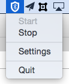
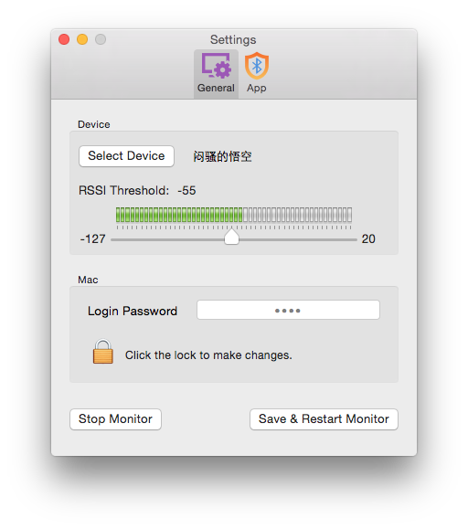

## MacGuarder ##

lock &amp; unlock Mac by iPhone with Bluetooth

## Usage ##

1 select a device to monitor
2 set the RSSI threshold for selected device
3 start

When the device is out of scope, Mac will be locked.
When the device is in the scope, Mac will be unlocked.
